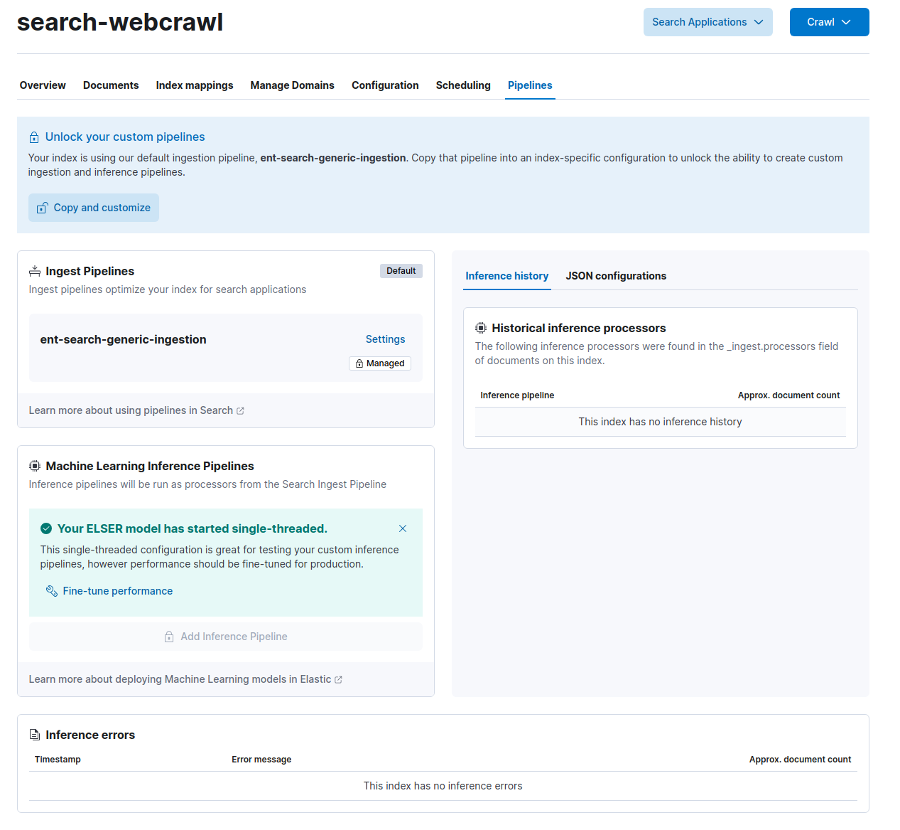
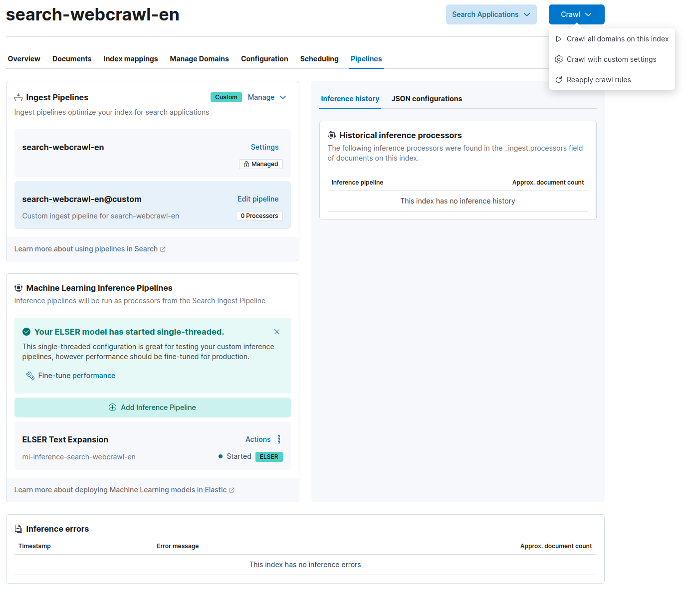
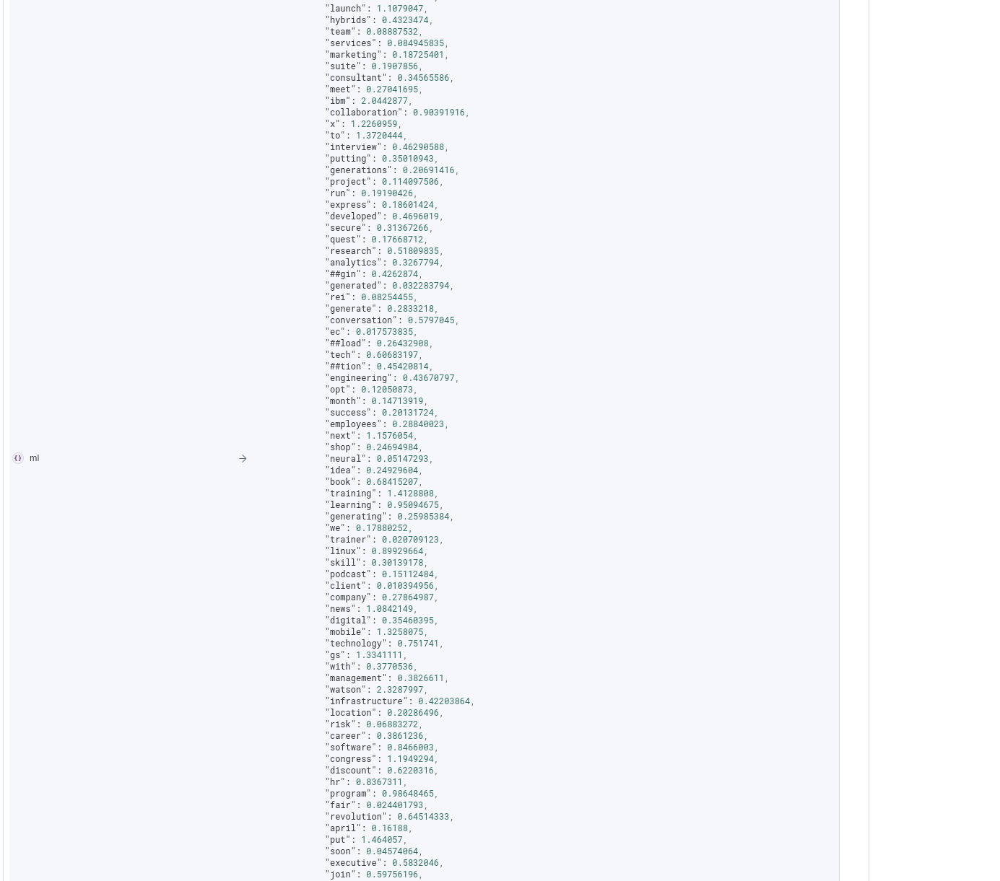

## Setup a web crawl index on watson<x>x</x> Discovery

If this is the first time, logging into the system, you may see a screen similar to the one below. You can choose **Add integrations** to jump straight to the Indices section or **Explore on my own** to familiarize yourself with the user interface. For the purposes of this exercise, select **Explore on my own**.


### Create a web crawl index in the UI

1.  In the upper left corner of the main screen, select the menu icon  and select the **Search** >> **Overview** in the menu. This will bring you to the main Search page. From here, select **Content** >> **Settings** in the left hand menu. Enable the **Deployment wide ML Inference Pipelines extraction** option and select **Save**.
2.  Now, go to **Content** >> **Indices** to view a list of indices already created on the system.
3.  Select **Create a new index** in the upper right of the window.
4.  Choose the **Use a web crawler** option. This will step through setting up a web crawl.

    1.  Provide a name and language for the index, then select **Create index**
    2.  The system now asks you to provide a url to crawl. Provide this information for the site you want to crawl, then select **Validate Domain**. This test will ensure that the site can be crawled. Verify any warnings and then select **Add domain**. Repeat this if there are multiple domains that need to be crawled.

5.  Do **not** start the web crawler yet. This will be done later.

### Update the default web crawl index mapping

Since certain web pages provide a large amount of data on a single page, it is best to setup the data ingestion into chunked sections of text. This helps with limitations in the embedding model as well as ease of search. To setup a chunking processor, the first thing to do is add the following piece of JSON to the index mapping. This document will step through this process using the Dev Tools built into the UI.

1.  In the upper left corner of the main screen, select the menu icon  and select the **Management** >> **Dev Tools** option.
2.  Create a new line Console window and paste the following code into the window, ensuring you change the index name to what was created in the previous section:
    ```json hl_lines="1"
        PUT your_index_name/_mapping
        {
          "properties": {
            "passages": {
              "type": "nested",
              "properties": {
                "sparse.tokens": {
                  "type": "sparse_vector"
                }
              }
            }
          }
        }
    ```
3.  Once the code is in place and the index name is updated, run the code by pressing the green arrow at the end of the first line or pressing ++ctrl+enter++.
4.  If everything was entered correctly, you should receive the following response:
    ```json
    {
      "acknowledged": true
    }
    ```

### Create the custom ingest pipeline

1.  Select the \*\*Pipelines tab in your index configuration.
    
2.  The default pipeline cannot be customized, so choose the **Copy and customize** button to create a custom pipeline. This will create a new pipeline with the same name as your index with an added `@custom` at the end.
3.  Click on the `Edit pipeline` of the custom pipeline, then `Manage` >> `Edit`.
4.  On the pipeline edit page, two processors need to be created. Choose `Add a processor`

    1.  Add a `Script` processor. The below [painless script](https://www.elastic.co/guide/en/elasticsearch/reference/current/modules-scripting-painless.html) will be used to chunk the incoming data from the web crawl. Copy and add the code to the `Source` field.

        ```Groovy
        String[] envSplit = /((?<!M(r|s|rs)\.)(?<=\.) |(?<=\!) |(?<=\?) )/.split(ctx['body_content']);
        ctx['passages'] = [];

        StringBuilder overlappingText = new StringBuilder();

        int i = 0;
        while (i < envSplit.length) {
            StringBuilder passageText = new StringBuilder(envSplit[i]);
            int accumLength = envSplit[i].length();
            ArrayList accumLengths = [];
            accumLengths.add(accumLength);

            int j = i + 1;
            while (j < envSplit.length && passageText.length() + envSplit[j].length() < params.model_limit) {
                passageText.append(' ').append(envSplit[j]);
                accumLength += envSplit[j].length();
                accumLengths.add(accumLength);
                j++;
            }

            ctx['passages'].add(['text': overlappingText.toString() + passageText.toString(), 'title': ctx['title'], 'url': ctx['url']]);
            def startLength = passageText.length() * (1 - params.overlap_percentage) + 1;

            int k = Collections.binarySearch(accumLengths, (int)startLength);
            if (k < 0) {
                k = -k - 1;
            }
            overlappingText = new StringBuilder();
            for (int l = i + k; l < j; l++) {
                overlappingText.append(envSplit[l]).append(' ');
            }

            i = j;
        }
        ```

        Also add the following snippet to the `Parameters` field:

        ```json
        {
          "model_limit": 2048,
          "overlap_percentage": 0.25
        }
        ```

        Click `Add Processor` in the bottom right corner to save it.

    2.  Click `Add a processor` in the main window and select a type of `Foreach`. Specify `passages` to as the `Field`, then add the following JSON config to the `Processors` field.

        ```json
        {
          "inference": {
            "field_map": {
              "_ingest._value.text": "text_field"
            },
            "model_id": ".elser_model_2_linux-x86_64",
            "target_field": "_ingest._value.sparse",
            "inference_config": {
              "text_expansion": {
                "results_field": "tokens"
              }
            },
            "on_failure": [
              {
                "append": {
                  "field": "_source._ingest.inference_errors",
                  "value": [
                    {
                      "message": "Processor 'inference' in pipeline '{{ _ingest.on_failure_pipeline }}' failed with message '{{ _ingest.on_failure_message }}'",
                      "pipeline": "<your_index_name>@custom",
                      "timestamp": "{{{ _ingest.timestamp }}}"
                    }
                  ]
                }
              }
            ]
          }
        }
        ```

        Ensure that you have changed the `<your_index_name>` to the name of the ingest pipeline that was created with the index. Save the processor.

    3.  Once the two processors are added, click on `Save Pipeline` in the main window.
    4.  Go back to your index under **Search** >> **Indices** and select your index.

5.  With the ingest pipeline created, the domains added, we are now ready to crawl the websites provided. In the upper right corner of the index, select the **Crawl** dropdown and choose `Crawl all domains on this index` to start it.
    
6.  Once documents start coming in, you can verify that the model is working correctly by switching to the **Documents** tab within the index and expanding a document. Look for the **passages** field and ensure that it has a list of tokens similar to the screenshot below.
    

Allow some time for the crawler to index the site. This could be anywhere from a few minutes to several hours depend on the number of domains and size of the site. In the meantime, we can continue to the next step to tie watson<x>x</x> Assistant and watson<x>x</x> Discovery together for Conversation Search.

??? info

    During the Techzone reservation setup process, the ELSER model has been deployed and should be available to use for your indices.

    Elastic Learned Sparse EncodeR --or ELSER-- is an NLP model trained by Elastic that enables you to perform semantic search by using sparse vector representation. Instead of literal matching on search terms, semantic search retrieves results based on the intent and the contextual meaning of a search query.

## Connect watson<x>x</x> Discovery to watson<x>x</x> Assistant

Now that watson<x>x</x> Discovery is ingesting data from the web crawler, it is time to setup Conversational Search for watson<x>x</x> Assistant. You can use the link in the Techzone reservation or navigate to in via [IBM Cloud](https://cloud.ibm.com/resources){target="\_blank"}. If this is the first time accessing the Assistant, then create a new Assistant by following the prompts on the page.

Once an Assistant is created, follow these steps to connect watson<x>x</x> Discovery and enable Conversational Search.

1.  Go to the Environments Section and add a Search extension for the Draft environment.
    
2.  Select the Elastic Search option in the window that opens.
    
3.  Enter the details for watsonx Discovery. All of this information can be found in the Techzone Reservation, so ensure that this window is open and available. The following list goes in order of what is needed for the Assistant to connect.

    1.  Enter the watson<x>x</x> Discovery URL information.

        ??? note

            In the early release of the Techzone collection, the username and password are built into the URL.  You will need to delete everything between the `https://` and the `@`, making sure to delete the `@` as well.  This URL output will be updated in a later release of the Collection.

    2.  Enter the port provided.
    3.  Enter the index that was created in the previous section.
    4.  Provide the username that you used to login to Kibana.
    5.  Provide the password used previously.
        

4.  Once the necessary information has been provided, click the **Next** button in the upper right.
5.  In this section, provide the following values for each of the fields required. This is standard for a web crawl index.
    1.  **Title**: `title`
    2.  **Body**: `text`
    3.  **URL (optional)**: `url`
        Enable the ==Conversational Search== feature to showcase generative AI in action.
        
6.  Before finishing the setup, we need to ensure that watson<x>x</x> Assistant uses the semantic search capabilities of watson<x>x</x> Discovery. To do this, expand the **Advanced Elasticsearch settings** section and add the following JSON code into the query body section.

    ```json
    {
      "query": {
        "nested": {
          "path": "passages",
          "query": {
            "text_expansion": {
              "passages.sparse.tokens": {
                "model_id": ".elser_model_2_linux-x86_64",
                "model_text": "$QUERY"
              }
            }
          },
          "inner_hits": { "_source": { "excludes": ["passages.sparse"] } }
        }
      },
      "_source": false
    }
    ```

    ??? Note
        Please note the model that is deployed for your service by looking at the Analytics -> Machine Learning -> Trained Models section. Verify whether the **.elser_model_2** or the **.elser_model_2_linux-x86_64** model is deployed.

    

    Click **Finish** in the upper right to save the configuration.

    ??? info
    Since the above query is using `inner_hits`, the Assistant will only receive the data within the `_source` field. Therefore, your fields above must reflect where the content resides.

7.  With the search extension in place, move to the **Actions** section of the Assistant, then navigate to the ==Set by Assistant== actions. Choose the **No action matches**.
8.  Delete all of the steps within the action and create a new one. In the ==And then== section, choose **Search for the answer**. Click save and exit.
    
9.  Now it is time to test the connection. Open the preview section or the preview button in the lower right if you are still in the actions window. Type in a question relevant to the content that was crawled. Since no other actions have been created at this time, the Assistant will default to searching for an answer. You should be able to see a generative response if the ==Conversational Search== feature was enabled; otherwise, you will see a list of relevant documents that contain information about your question.
    

# Conclusion

By following these steps, we have created a demo environment that uses watson<x>x</x> Discovery as a knowledge base and connected it to watson<x>x</x> Assistant for a conversational search use case. You can read more about the conversational search capabilities [here](https://cloud.ibm.com/docs/watson-assistant?topic=watson-assistant-conversational-search). To read more about semantic search, go [here](https://www.elastic.co/guide/en/elasticsearch/reference/current/semantic-search-elser.html).
