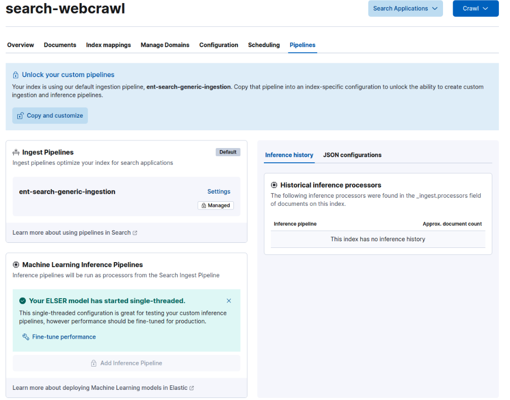

# Setting up a RAG solution using watsonx Discovery with a simple Webcrawl connected to watsonx Assistant. 

## Set up watsonx Discovery on your cloud account 

**NOTE**: **watsonx Discovery** is synonymous with **IBM Cloud Databases for Elasticsearch**. 

See [Elastic + Kibana + Enterprise Search deployment](https://github.com/ibm-build-lab/terraform-elasticsearch-setup) for automation to provision **IBM Cloud Databases for Elasticsearch** with **Kibana** and **Enterprise Search**. 

Take note of the Kibana endpoint that will be produced at the end of the Terraform automation. This will be your login point into the database. 

### Download and deploy the ELSER model to create the search embeddings: 

For this PoC, we are using the ELSER (Elastic Learned Sparse Encoder) model which is an out-of-domain sparse vector model that does not require fine-tuning. NOTE: it is currently available only in English.  

In **Kibana**, click on the hamburger menu on the top left and navigate to **Analytics** >>  **Machine Learning** >> **Trained Models**. Click the **Download** button under **Actions** column, we chose the recommended `.elser_model_2_linux-x86_64` model. You can see the download status under the State column. 


Give this time to download. You may need to refresh the window to see when it is downloaded. Once it is done, start deployment by clicking the **Deploy** link that will show up when you hover the mouse over the downloaded model. Take the defaults on the dialog and select Start. State should show **Deployed** if done successfully. 

## Setup a web crawl index in ElasticSearch instance 

Go into **Kibana** UI. You may see an introduction screen if this is your first time logging into the system. You can choose **Add integrations** to jump straight to the Indices section or **Explore on my own** to familiarize yourself with the user interface. For this exercise, select **Explore on my own**. 


1. Go to  **Content** >> **Indices**. Select **Create a new index** in the upper right of the window. 

1. Choose the **Use a web crawler** option. This will step through setting up a web crawl. 

    a. Provide a name and language for the index, then select **Create index**

    b. The system now asks you to provide a URL to crawl. Provide this information for the site you want to crawl, then select **Validate Domain**. This test will ensure that the site can be crawled. Verify any warnings and then select **Add domain**. Repeat this if multiple domains need to be crawled. 

    c. Under the **Manage Domains** tab, set up crawl rules for each domain if necessary to narrow down the specific entry points you want to crawl. Select the desired domain and select **Crawl rules**. For example, the following rules exclude everything except the `www.nationalparks.org/explore/parks` level:  

      

1. Now that the site is selected, an ingest pipeline can be created to use the ELSER model for semantic search capabilities. 

    a. Select the **Pipelines** tab in your index configuration. 

      

    b. The default pipeline cannot be customized, so choose the **Copy and customize** button to create a custom pipeline. This will create a new pipeline with the same name as your index with an added `@custom` at the end. This does not need to be modified for a basic web crawl. 

    c. In the **Machine Learning Inference Pipelines** section, select **Add inference pipeline**. This will open a new window to configure the pipeline to index certain fields with ml tokens using a ML model. 

    d. The name in this section can remain the same, but you will need to select the ML model to use for embedding. Choose ELSER as the model. Press **Continue** in the lower right.  

      

    e. The next section allows you to choose which fields will be mapped using the ELSER model. For this web crawling index, select the `body_content` and `title` fields to be mapped, the press **Add**. Press **Continue** once the fields have been added. 

      

    f. Press **Continue** in the **Test** section. Review the pipeline and then click **Create pipeline** to finish. 

1. With the inference and ingest pipelines created, and the domains added, we are now ready to crawl the websites provided. In the upper right corner of the index, select the **Crawl** dropdown and choose **Crawl all domains on this index** to start it. 

1. Once documents start coming in, you can verify that the model is working correctly by switching to the **Documents** tab within the index and expanding a document. Look for the **ml** field and ensure that it has a list of tokens.  

    Allow some time for the crawler to index the site. This could be anywhere from a few minutes to several hours depending on the number of domains and size of the site. In the meantime, we can continue to the next step to tie **watsonx Assistant** and **watsonx Discovery (ElasticSearch)** together for Conversation Search. 

## Connect watsonx Discovery to watsonx Assistant 

Now that **watsonx Discovery (ElasticSearch)** is ingesting data from the web crawler, it is time to set up Conversational Search for **watsonx Assistant**. Navigate to **watsonx Assistant** in via [IBM Cloud](cloud.ibm.com). If this is the first time accessing the Assistant, then create a new Assistant by following the prompts on the page. 


Once an Assistant is created, follow these steps to connect **watsonx Discovery** and enable Conversational Search. 

1. Go to the service instance for the **ElasticSearch** database on your IBM Cloud account, and create a credential. 

1. Go to the **Environments** section within **watsonx Assistant** and add a **Search** extension for the **Draft** environment.  

   
 

1. Select the **Elastic Search** option in the window that opens.  

1. Enter the details for **ElasticSearch**. The following list goes in order of what is needed for the Assistant to connect. 

      - Enter the URL information in the credential (the HTTPS option under the arguments -u flag without port #) that you set up in step 1. 

      - Enter the port provided. 

      - Provide the username and password you used when you set up watsonx Discovery, if you ran the terraform automation from the first section. Or you can create a new credential and use that. 

1. Once the necessary information has been provided, click the **Save** button. 

1. Enter the **ElasticSearch** index that was created in the previous section, click Save 

1. Next, you will be asked to enable conversational search.  Move the toggle to On and click **Save** 

1. In the next section, provide the following values for each of the fields required. This is standard for a web crawl index. 

    - **Title**: title 

    - **Body**: body_content 

    - **URL** (optional): url  


1. Before finishing the setup, we need to ensure that **watsonx Assistant** uses the semantic search capabilities of Elasticsearch. To do this, expand the **Advanced Elasticsearch** settings section and add the following JSON code into the query body section. This tells **Elasticsearch** to look in the `body_content`, `title` and `url` fields for a match: 

    ```
    { 
      "query": { 
        "bool": { 
          "should": [ 
            { 
              "text_expansion": { 
                "ml.inference.title_expanded.predicted_value": { 
                  "model_id": ".elser_model_2_linux-x86_64", 
                  "model_text": "$QUERY" 
                } 
              } 
            }, 
            { 
              "text_expansion": { 
                "ml.inference.body_content_expanded.predicted_value": { 
                  "model_id": ".elser_model_2_linux-x86_64", 
                  "model_text": "$QUERY" 
                } 
              } 
            } 
          ] 
        } 
      } 
    } 
    ```

    Click **Save**. 

1. With the search extension in place, move to the **Actions** section of the Assistant, then navigate to the **Set by Assistant** actions. Choose **No action matches**. 

1. Delete all of the steps within the action and create a new one. In the **And then** section of the new action, choose **Search for the answer**. Save (disk icon on top right) and exit (x icon on top right).  


Now it is time to test the connection. Click the **Preview** icon on the left or the **Preview** button in the lower right of the **Actions** window. Type in a question relevant to the content that was crawled. Since no other actions have been created at this time, the Assistant will default to searching for an answer. You should be able to see a generative response if the Conversational Search feature was enabled; otherwise, you will see a list of relevant documents that contain information about your question.  


## Optional:  

An alternative way to set up an Elasticsearch webcrawl with document chunking is documented [here](./README_webcrawl.md).  

## Additional Documentation:  

https://github.com/watson-developer-cloud/assistant-toolkit/blob/master/integrations/extensions/docs/elasticsearch-install-and-setup/ICD_Elasticsearch_install_and_setup.md 

## Conclusion 

By following these steps, we have created an environment that uses **watsonx Discovery (ElasticSearch)** as a knowledge base and connected it to **watsonx Assistant** for a conversational search use case. You can read more about the conversational search capabilities [here](https://cloud.ibm.com/docs/watson-assistant?topic=watson-assistant-conversational-search). To read more about semantic search, go [here](https://ibm.ent.box.com/folder/253751253370?s=9m5vr25cws6ivlqvmg4q68h8d03twxp8). 

 
Copyright © 2024 IBM Technology Sales
